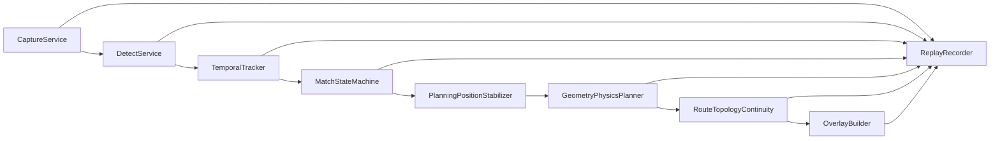

# Architecture

## Runtime Chain

## Design Notes

- 每个模块输出结构化对象，方便 JSONL 回放。
- 采集层和推理层都是可替换边界。
- 标定层支持旧 OpenCV YAML 和旧投影标定 JSON。
- 状态机按时间窗口推进，不直接信任单帧检测结果。
- 路线稳定只修改规划用球心；原始跟踪和状态机坐标保持不变。
- 每帧重新计算完整物理路线，拓扑连续模块只能选择本帧有效候选，不保存旧坐标。
- 阻挡球碰撞净空始终使用本帧原始测量位置，避免滤波延迟降低安全性。
- 学习系统不在本程序内实现，不做训练数据采集。
