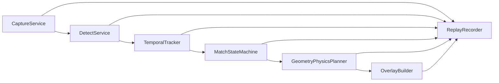

# Architecture

## Runtime Chain

```mermaid
flowchart LR
    A["CaptureService"] --> B["DetectService"]
    B --> C["TemporalTracker"]
    C --> D["MatchStateMachine"]
    D --> E["GeometryPhysicsPlanner"]
    E --> F["OverlayBuilder"]
    A --> G["ReplayRecorder"]
    B --> G
    C --> G
    D --> G
    E --> G
    F --> G
```

## Design Notes

- 每个模块输出结构化对象，方便 JSONL 回放。
- 采集层和推理层都是可替换边界。
- 标定层支持旧 OpenCV YAML 和旧投影标定 JSON。
- 状态机按时间窗口推进，不直接信任单帧检测结果。
- 学习系统不在本程序内实现，不做训练数据采集。

