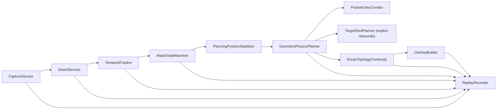

# Architecture

## Runtime Chain

## Design Notes

- 每个模块输出结构化对象，方便 JSONL 回放。
- 采集层和推理层都是可替换边界。
- 标定层支持旧 OpenCV YAML 和旧投影标定 JSON。
- 状态机按时间窗口推进，不直接信任单帧检测结果。
- 路线稳定只修改规划用球心；原始跟踪和状态机坐标保持不变。
- 每帧重新计算完整物理路线，拓扑连续模块只能选择本帧有效候选，不保存旧坐标。
- 阻挡球碰撞净空始终使用本帧原始测量位置，避免滤波延迟降低安全性。
- `PocketEntryCorridor` 在有限袋口内搜索完整球可通过的球心入口；拟合袋心只保留为袋号和洞心语义，不再强迫物体球线穿过单一点。
- 非撞库目标球路线必须是从目标球到袋口走廊的单一直线；需要撞库的路线只能由目标击球模块给出包含真实碰库点的显式折线，禁止在袋口人工插入无碰撞折点。
- `PerBallPocketFSM` 使用统一可信入袋轨迹：同 ID 轨迹、跨 ID 历史接力和预击球袋唇离开共享连续袋口深度、横向走廊、速度、视觉运动、持续消失与重现校验。
- `POCKET_DETECTED` 会封存本次物理球身份并保留到回合账本提交；跟踪器随后复用同一 ID、分配新 ID 或修正花色时，后续向内穿越会建立新的决定。身份重启帧只初始化新球，下一帧轨迹或袋口视觉再建立候选，避免继承邻球速度后被反向门禁抢先拒绝。
- `TURN_RESOLVE` 的等待截止时间由活动候选的确认窗口和观察超时共同决定，配置的 `turn_resolve_grace_ms` 作为基础下限；等待期间出现的新候选会刷新绝对截止时间。持续可见且无法通过消失证据成熟的候选仍按有限宽限结束。
- Modern 击球开始投票使用相邻帧速度增量和实际时间差计算加速度；持续匀速运动只保留运动票，速度跃迁或加速度峰值至少出现一项后才能产生新的 `SHOT_START_VOTED`。
- 进球通知分为即时检测和规则确认：`POCKET_DETECTED` 到达时桌面GUI与Web立即提示，并把该决定投影到临时库存与下一球目标花色；后续同决定的 `POCKET_CONFIRMED / POT_PROBABLE` 只做去重并由正式账本接管，`POCKET_REJECTED` 会回滚临时目标并提示“判定撤销”。正式演员花色、库存和裁判状态仍在不可撤销确认后提交。桌面提示使用视频预览内弹层，连续提示会强制闪烁刷新，投影窗口保持独立。
- 学习系统不在本程序内实现，不做训练数据采集。
