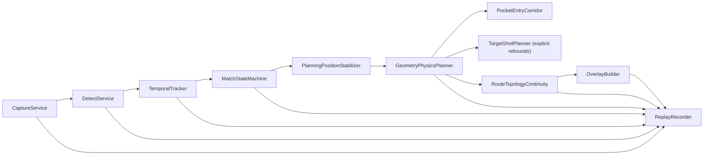

# Architecture

## Runtime Chain

## Design Notes

- 每个模块输出结构化对象，方便 JSONL 回放。
- 采集层和推理层都是可替换边界。
- 标定层支持旧 OpenCV YAML 和旧投影标定 JSON。
- 状态机按时间窗口推进，不直接信任单帧检测结果。
- 路线稳定只修改规划用球心；原始跟踪和状态机坐标保持不变。
- 每帧重新计算完整物理路线，拓扑连续模块只能选择本帧有效候选，不保存旧坐标。
- 阻挡球碰撞净空始终使用本帧原始测量位置，避免滤波延迟降低安全性。
- `PocketEntryCorridor` 在有限袋口内搜索完整球可通过的球心入口；拟合袋心只保留为袋号和洞心语义，不再强迫物体球线穿过单一点。
- 非撞库目标球路线必须是从目标球到袋口走廊的单一直线；需要撞库的路线只能由目标击球模块给出包含真实碰库点的显式折线，禁止在袋口人工插入无碰撞折点。
- `PerBallPocketFSM` 使用统一可信入袋轨迹：同 ID 轨迹、跨 ID 历史接力和预击球袋唇离开共享连续袋口深度、横向走廊、速度、视觉运动、持续消失与重现校验。
- 进球通知位于不可撤销确认 seam：`POCKET_DETECTED` 只表示内部确认窗口已通过，桌面GUI与Web等待 `POCKET_CONFIRMED / POT_PROBABLE` 后提示，并由共享的 `PocketNoticeTracker` 按决定编号去重。桌面提示使用视频预览内弹层，投影窗口保持独立。
- 学习系统不在本程序内实现，不做训练数据采集。
