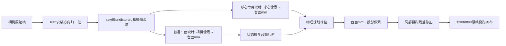

# BAS 台球辅助系统：开发路线、校准链路与算法实现大纲

> 本文按仓库代码、当前 `local_settings/user_settings.json` 以及其正在引用的校准产物整理。
> 它适合作为技术汇报、项目说明书或答辩材料的母稿。硬件品牌、相机具体型号、镜头型号、
> 投影仪具体型号和训练集规模未写入仓库，因此本文只给出代码能够证明的运行规格与选型原则，
> 不虚构设备型号或数据量。

## 0. 项目总览与当前实现结论

### 0.1 系统目标

BAS 是一套“顶置工业相机感知 + 台面毫米坐标建模 + 物理几何算路 + 投影仪原位叠加 +
比赛/训练状态管理”的实时台球辅助系统。其核心不是单一的目标检测模型，而是把感知、标定、
跟踪、状态机、路径规划、投影和训练规则串成一条可验证的闭环：

```text
工业相机帧
  -> YOLO 检测与球心轮廓精修
  -> 跨帧跟踪与速度估计
  -> 像素球心到台面毫米坐标
  -> 比赛/训练状态与进球证据
  -> 几何候选路线生成、碰撞筛选与评分
  -> 台面毫米坐标到投影像素
  -> 球桌上的实时路线、目标区和中文提示
```

### 0.2 当前现场配置快照

| 项目 | 当前值 | 实现含义 |
|---|---:|---|
| 相机输入 | 1920 × 1080，30 FPS | 顶置画面，运行时顺时针归一化 180° |
| 相机控制 | UVC，手动曝光 -7，手动白平衡 4600 K | 避免自动参数漂移破坏检测与标定一致性 |
| 畸变校正 | **当前关闭** | 当前联合校准与球心补偿均工作在 raw 像素域 |
| 规则检测 | Ultralytics YOLO11m，最多 15 Hz | 白球/实色/花色/黑球四组，切片推理并做跨切片 NMS |
| 训练检测 | YOLO11s，0–15 共 16 类 | 训练模式按需加载，不与规则模型混用 |
| 投影输出 | 1280 × 800，屏幕 1 | 全屏输出；投影标定与运行输出旋转均为 0° |
| 状态机 | Modern | 事件证据、逐球进洞 FSM、重现反证和人工复核 |
| 算路模式 | 当前为规则模式 | 同时支持勾球模式；当前路线冻结关闭 |
| 球心补偿 | 开启 | 当前引用 2026-08-05 的临时激活模型 |
| 训练模式 | 已实现，当前未启用 | 当前运行模式为 rules，预选场景为新手单球直线入袋 |

### 0.3 三个必须在汇报中讲清的口径

1. **“ArUco 码投射”在实际代码中是 ChArUco 联动校准。**
   ChArUco 以 ArUco marker 提供身份编码，再用棋盘交点提供亚像素级角点；它比只检测单个
   ArUco 方框角点更适合做密集平面对应点拟合。
2. **相机标定文件包含内参和外参，但当前运行几何不使用相机外参。**
   当前几何模式是 `independent_2d`，使用相机像素、台面毫米和投影像素之间的二维平面映射；
   `camera_extrinsics_used = false`。当前畸变校正开关也处于关闭状态。
3. **当前球心补偿文件保留 56 条训练残差记录，有效补偿与展示口径为 53 点。**
   按现场确认的实际计算范围，原始点位 #16、#22、#56 未纳入有效补偿计算，因此最终残差图
   明确按编号排除这 3 点；源配置仍保留其残差记录用于追溯，不能用残差阈值代替编号口径。

---

## 1. 整体开发路线

## 1.1 工业相机选型与安装

### 1.1.1 选型目标

- 一帧覆盖完整台面与六个袋口，边角球仍有足够像素直径供轮廓精修。
- 能在 1920 × 1080、30 FPS 下稳定输出；推理可独立限频，采集不因模型吞吐而阻塞。
- 支持手动曝光、白平衡和固定焦距，避免帧间亮度/颜色变化导致分割、轮廓和背景模型漂移。
- 支持 UVC/OpenCV 通用链路；现场若使用 Nori SDK，也能通过相同 `CaptureService` 接口接入。
- 相机与镜头固定后可重复获得一致像素域；机械支架必须限制平移、俯仰、滚转和焦点漂移。

### 1.1.2 当前实现路径

- `CaptureService` 统一封装 UVC/OpenCV、Nori SDK、视频回放和合成输入。
- 相机安装方向在采集边界统一归一化，当前为顺时针 180°；后续检测、几何标注和联合校准
  都只面对归一化后的坐标域。
- 当前现场关闭自动曝光和自动白平衡，使用曝光 -7、白平衡 4600 K。
- 采集帧和检测帧解耦：相机 30 FPS，检测上限 15 Hz；非推理帧可复用缓存检测结果，保证
  UI、录像和状态时间线连续。

### 1.1.3 安装与验收

- 相机光轴尽量靠近台面中心法线，完整看见台面、库边与六袋；最终几何允许透视，但过大的
  斜视会降低边缘球体轮廓质量和有效分辨率。
- 固定焦距、焦点、曝光、白平衡和输入画幅后再开始标定；任一项改变都应使旧标定失效。
- 验收时检查中心、四角、长边中部、短边中部和袋口附近的清晰度，不只检查台面中心。
- 建议在正式文档补录相机型号、传感器尺寸、镜头焦距/光圈、工作距离、支架结构和安装高度；
  这些信息当前不在仓库内。

### 1.1.4 值得 Highlight：采集边界完成方向归一化

相机 180° 安装差异只在采集边界处理，而不是在检测、标注、投影和每个算法模块中分别旋转。
这把“方向”从一个全系统隐患压缩成单一可审计的接口，并通过校准上下文指纹防止旧方向产物
被静默套用。

## 1.2 畸变校准：内参、外参与实际运行关系

### 1.2.1 已有标定产物

- `calib/intrinsics_0730.yaml`：1920 × 1080 内参和八参数 `rational_polynomial` 畸变模型。
- `calib/calibration_0730.yaml`：除内参/畸变外，还包含旋转矩阵、`rvec` 和 `tvec`。
- 数据来自 HALCON `area_scan_division` 模型；转换到 OpenCV 后，相对 HALCON 原模型的稠密
  回投影拟合 RMS 约 `2.17e-8 px`、最大值约 `9.75e-7 px`。这只是**模型转换一致性**，
  不是相机对真实世界的标定精度。

### 1.2.2 代码中的去畸变链路

1. 按安装角度旋转原始帧，形成规范坐标域。
2. 若畸变开关打开且标定文件有效，按实际分辨率缩放相机矩阵。
3. 使用 `cv2.initUndistortRectifyMap` 预计算映射表。
4. 每帧用 `cv2.remap` 去畸变，并在帧元数据写入畸变状态和文件路径。
5. 联合校准产物保存 `camera_coordinate_domain` 和 `distortion_fingerprint`；运行时不匹配则拒绝。

### 1.2.3 当前现场真实状态

当前 `distortion_correction_enabled = false`，联合校准产物记录：

- `camera_coordinate_domain = raw`
- `distortion_fingerprint = null`
- `frame_rotation_degrees = 180`

因此现阶段不能把系统描述为“正在使用内外参完成三维定位”。更准确的说法是：项目已经具备
内参去畸变能力并保存过外参，但当前正式链路采用原始像素域上的二维独立几何，外参不参与
运行时求解。

### 1.2.4 具体决策路径

- 若开启畸变校正，必须重新执行联合校准、球心补偿和独立 Holdout，不能只切换开关。
- 若保持关闭，则所有标注、台面边界、联合校准、球心补偿和运行输入都必须继续使用 raw 域。
- 汇报时应把“外参标定产物存在”和“外参参与运行算法”分开陈述。

## 1.3 图片与视频采集

### 1.3.1 采集目标

- 采集空台、静态摆球、运动球、球杆遮挡、袋口高速入球、反光/阴影等真实工况。
- 同时保留原始帧、检测、跟踪、状态、规划和投影事件，支持问题复现与回归。

### 1.3.2 当前实现

- 实时采集包包含 `frame_id`、单调时钟时间戳、相机 ID、图像和曝光元数据。
- 支持无投影线照片/视频、进洞路线视频、即时回放分段、事件 JSONL 和深度状态调试时间线。
- 视频回放输入复用同一感知与算法链路，可在不占用现场硬件时回归失败案例。
- 回放记录把检测、跟踪、状态、候选路线和覆盖层保存为结构化对象，便于定位“检测错、跟踪错、
  状态错、几何错还是显示错”。

## 1.4 数据标注

### 1.4.1 标注体系

- 规则比赛模型：白球、实色、花色、黑球以及球杆相关类别，运行时归一化为
  `cue/solid/stripe/black`。
- 编号训练模型：0–15，其中 0 为白球、1–7 为实色、8 为黑八、9–15 为花色。
- 台面几何：`outline`、`inline` 和六个 `pocket` 曲线，作为规划、进洞、检测区域和投影边界的
  共同几何来源。

### 1.4.2 标注方向维护

仓库提供 LabelMe 标注 180° 旋转工具，用于相机安装方向切换后的图像和 polygon/rectangle/
circle/line/point 标注同步转换。转换后应抽查：

- 图像和 JSON 尺寸一致；
- 所有标注点满足 `(x, y) -> (W-x, H-y)` 的同域变换；
- 类别名、分组和图像路径不被破坏；
- 边缘球、袋口与球杆遮挡样本仍保留足够比例。

## 1.5 机器学习

### 1.5.1 检测模型

- 规则模式使用 YOLO11m；当前图像按 1280 像素 tile 切片，tile 间保留重叠区域，批量推理后
  对同类框执行跨切片 NMS。
- 若模型输出 segmentation mask，球心精修优先利用轮廓；无有效 mask 时从局部外观拟合椭圆，
  最后才退回 bbox 中心。
- 每个球输出检测置信度、精修球心、半径、几何质量和几何方法，后续跟踪与球心补偿不只读取框。
- 训练模式惰性加载独立的 16 类 YOLO11s，避免规则比赛启动时占用额外显存和混用类别语义。

### 1.5.2 路线学习接口

系统保留 JSON 线性/MLP 排序器接口，可基于几何候选特征输出进球、白球落袋、犯规、走位和
残差预测，再与规则评分混合。但当前现场配置中 `learning_ranker_enabled = false`，所以正在使用的
路线排序仍是确定性几何评分；学习样本采集已开启，用于后续离线训练。

### 1.5.3 训练与验收建议

- 数据集按视频序列或场次切分，避免相邻帧同时落入训练集和验证集形成泄漏。
- 单独统计中心、四边、四角、六袋、强反光、遮挡和高速运动工况。
- 模型指标不能替代端到端指标；最终仍需评估球心毫米误差、进洞误判/漏判和路线稳定性。

## 1.6 物理仿真与算法框架

### 1.6.1 模块边界

| 模块 | 输入 | 输出 |
|---|---|---|
| CaptureService | 工业相机/视频 | 带时间戳帧 |
| DetectService | 图像与台面 mask | 检测与精修球心 |
| TemporalTracker | 连续检测 | 稳定 track、速度、可见性 |
| ModernMatchStateMachine | track 与袋口视觉证据 | 比赛阶段、进球事件、目标花色 |
| GeometryPhysicsPlanner | 毫米球位、规则状态、球杆方向 | 候选路线、分数、风险 |
| OverlayBuilder | 最优路线与标定 | 投影图元和最终画布 |

### 1.6.2 几何物理模型

- 所有物理计算统一进入台面毫米坐标，球半径默认由 57.15 mm 直径确定。
- 目标球到袋口的方向确定母球与目标球相切时的 ghost ball 位置。
- 母球路径和目标球路径都按“线段到其他球心的最短距离 - 两球半径”计算净空。
- 台面边界不是简单轴对齐矩形：路线检查使用由 `inline/pocket` 推导的可达多边形，并在袋口末端
  使用 pocket relief 放宽，避免合法进袋线在袋口边界被误删。
- 路线输出保存切球角、母球距离、目标球距离、净空、分数、风险与解释字段，方便回放审计。

## 1.7 投影仪选型与安装

### 1.7.1 代码能够确认的运行规格

- 当前输出分辨率为 1280 × 800，Windows 屏幕索引为 1，全屏输出。
- 投影标定旋转和输出旋转都为 0°；小角度视觉微调由颗星公式单独承担，当前角度为 -1.7°。
- 当前可见底边内缩 12 mm，物理四边库边内缩均为 10 mm。

### 1.7.2 选型与安装原则

- 能覆盖完整球桌，四角和袋口仍保持足够亮度与对焦；分辨率应与正式运行分辨率固定一致。
- 亮度要能克服台布吸光和环境光，但不能使相机中的 ChArUco 黑白区域过曝。
- 支架必须固定，尽量减少振动；Windows 缩放、显示器顺序、分辨率和梯形校正一旦变化就重标定。
- 投影焦平面应覆盖整桌，尤其关注远端长边和六袋；“中心清晰”不等于标定可用。
- 具体投影仪型号、流明、投射比和安装距离需现场补录，仓库未保存这些信息。

## 1.8 工业相机与投影仪联动校正

联动校正不是简单用四个角算一次单应矩阵，而是“多区域 ChArUco 密集采样 + RANSAC 基础映射 +
空间覆盖门禁 + 局部残差场”的组合。

### 1.8.1 图样设计

- 总览引导图，不参与求解。
- 中心细化 ChArUco。
- 全台布覆盖 ChArUco。
- 六个袋口重点图样。
- 5 × 4 全桌密集 tile 图样。
- 覆盖验收网格，不参与求解。

当前产物共使用 28 个求解图样，得到 545 对相机—投影对应点。

### 1.8.2 采集防串帧

投影切换图样后先丢弃过渡帧，再在多个检测帧中保留匹配角点最多的一帧。这样可以避免相机或
驱动缓存中的旧图样帧被错误地关联到新投影坐标。失败图样支持有限次数重试。

### 1.8.3 求解与质量门禁

1. 以有序台布四边形作为平面锚点。
2. 汇总有效 ChArUco ID 对应的相机点与投影点。
3. 用 RANSAC 拟合基础相机到投影单应矩阵。
4. 检查内点率、内点 P95、留一图样交叉验证和全桌覆盖。
5. 将全局模型仍无法解释的局部偏移保存为 residual control field；运行时再拟合规则化残差面。
6. 保存带上下文指纹和时间戳的 JSON，并自动写回当前设置。

当前联合校准关键结果：

| 指标 | 当前值 | 门禁 |
|---|---:|---:|
| 对应点 | 545 | 至少 80 |
| RANSAC 内点 | 541 / 545（99.27%） | 至少 80% |
| 内点重投影均值 | 0.644 px | 诊断值 |
| 内点重投影 P95 | 1.485 px | 不高于 3 px |
| 留一图样 CV P95 | 1.476 px | 不高于 5 px |
| 覆盖宽/高 | 97.30% / 97.70% | 各至少 85% |
| 凸包面积覆盖 | 85.72% | 至少 72% |
| 5 × 4 核心网格占用 | 100% | 必须 100% |
| 四边分段覆盖 | 100% | 必须 100% |

### 1.8.4 值得 Highlight：二维独立几何替代脆弱的伪三维链

项目明确维护三条关系：普通相机像素 ↔ 台面毫米、台面毫米 ↔ 投影像素、图像球心 → 真实球心。
对固定球桌、固定顶置相机和固定投影仪，二维平面映射直接对应最终任务，避免把未被实际使用的
外参、台面高度和投影仪“相机模型”硬塞进运行链路。代价是设备或平面条件变化时必须重标定，
不能把该方案宣传为通用三维测量系统。

## 1.9 球心补偿采集与计算

### 1.9.1 为什么联合校准后还需要球心补偿

ChArUco 标定的是台面平面上的角点，而检测器输出的是有高度球体在斜视相机中的图像中心。
球体高度、透视、mask/外观椭圆和 bbox 回退会让“图像球心直接落到台面平面”产生位置相关偏差。
球心补偿单独学习“检测到的球心像素 -> 真实台面球心毫米”，而不是用人工常量平移整桌。

### 1.9.2 采样与质量权重

- 向导在安全可达多边形中生成覆盖边缘、角落、袋口与中心的采样点，并按短移动顺序提示操作员。
- 每点等待球静止，采集连续稳定帧；记录检测球心、半径、置信度、稳定性散布、几何质量和方法。
- 样本权重为：检测置信度 × 几何质量² × 方法权重 ÷ (1 + 稳定散布²)，并限制在 0.01–1.0。
- segmentation ellipse 权重最高，appearance ellipse 次之，bbox 显著降权，但不是简单删除。

### 1.9.3 运行模型

- 当前 56 个控制点直接拟合相机球心像素到目标台面毫米的 `_BallPlaneMap`。
- 基础模型用 RANSAC 单应矩阵；只有规则化残差面能把训练 P95 实质降低至少 10% 时才叠加残差面。
- 当前模型选择结果为单纯 `homography`，空间交叉验证 P95 为 8.570 mm，门禁上限 10.287 mm。
- 模型在采样凸包内全权重工作，凸包外按到边界的距离做 smoothstep 连续衰减，最终平滑回退到
  普通平面几何，避免边界处发生突跳。

### 1.9.4 当前数据质量

| 指标 | 当前值 |
|---|---:|
| 训练点 | 56 |
| 训练残差 mean / median | 3.063 / 2.899 mm |
| 训练残差 P95 / max | 5.844 / 13.116 mm |
| 残差 ≥1 / ≥2 / ≥5 mm | 53 / 35 / 4 |
| 目标覆盖宽/高/凸包 | 97.11% / 94.22% / 90.44% |
| 采样稳定散布 median / P95 | 0.196 / 1.053 px |
| 检测置信度 median | 0.922 |

当前文件为 `temporary_activation = true`，且正式 Holdout 状态为
`not_run_after_training_resample`。复用的旧 Holdout 仅作为诊断：10 个位置、每点 3 次，重复放置误差
mean 0.277 mm，但端到端误差 median 1.945 mm、P95 5.029 mm，未通过正式阈值
median <1 mm、P95 <2 mm。由于这些 Holdout 观测早于最新 7 个训练点重采，不能作为新模型的正式验收。

### 1.9.5 53 点展示口径

53 点图按原始一基编号排除未纳入有效补偿计算的 #16、#22、#56：

| 原始点位 | 残差 |
|---:|---:|
| #16 | 7.969 mm |
| #22 | 13.116 mm |
| #56 | 6.975 mm |

排除后的 53 点统计为 mean 2.707 mm、median 2.463 mm、P95 4.451 mm、max 5.467 mm；
其中 `<2 mm` 21 点、`2–5 mm` 31 点、`>=5 mm` 1 点。该统计代表本次确认的有效补偿点空间残差，
但仍不能代替独立 Holdout 精度验收。

## 1.10 算路算法优化

优化路线由“能算一条线”逐步发展为“稳定选择合法目标、生成可行路径、给出可解释评分、在投影上
稳定显示”：

1. 将检测框中心升级为 segmentation/外观椭圆球心，并把几何质量带入规划。
2. 统一球心像素到台面毫米的球体补偿，降低边缘区域的系统偏差。
3. 使用真实可达多边形和袋口放宽规则，替代矩形台面近似。
4. 目标选择统一使用球杆方向走廊，避免不同入口对擦边球产生不一致锁定。
5. 加入目标锁定、保持计时、切换确认、短时漏检宽限和开杆自动释放，减少路线闪烁。
6. bbox 回退采用软降权而非单帧硬删除，高置信稳定轨迹可短时继续参与规划。
7. 预留路线冻结和学习排序接口；当前现场路线冻结、学习排序均关闭，便于先验证确定性几何。

## 1.11 训练模式支持

### 1.11.1 统一训练引擎

所有训练项目复用 `TrainingSession`，项目只声明所需球号、进球阶段、摆球布局、目标区域、安全约束
和规则集；检测、编号跟踪、袋口判断、进度、计时、事件与投影输出不按场景复制实现。

### 1.11.2 已支持的训练层级

- 新手：单球自由入袋、单球直线、1–3 顺序、三点顺序、三球/五球自由清台。
- 入门：短线、三点、自由清台、左右换边和五球清台。
- 白球控制：两球衔接、停球区、前进区、回位区；白球低于静止阈值并稳定至少 650 ms 后判定。
- 进阶：1–7 一字线、15 球蛇彩、1–9 轮转、单双号双排、实色/花色清台 + 黑八、6–7–8 收官。
- 其它：真实物理尺寸的纯投影出杆检测，不启动相机、编号检测、进洞与算路。

### 1.11.3 规则复用

- 训练进球事实复用规则模式 `PerBallPocketFSM`，只接收高置信 `POCKET_DETECTED`，不把普通消失
  或“最后位置靠近袋口”当成进球。
- `guided` 规则用于新手：误进/白球落袋提示重摆但不清空已完成进度。
- `strict` 规则用于进阶：进错号码、黑八过早、白球落袋或多球顺序不明立即失败。
- 带推荐区域的训练，投影边界与摆球校验使用同一归一化几何，保证“看到的区域就是判定区域”。

---

## 2. 校准链路设计

## 2.1 坐标系统与变换顺序



## 2.2 ChArUco 投射校准流程

1. 锁定相机方向、分辨率、畸变域、投影屏幕和分辨率。
2. 从台面 `outline/inline/pocket` 生成投影有效区域和图样 ROI。
3. 依次显示中心、全域、六袋和 5 × 4 tile ChArUco 图样。
4. 每次切图先清缓存帧，再检测 ChArUco ID 和交点。
5. 按相同 ID 形成相机像素—投影像素对应点。
6. RANSAC 求基础单应矩阵，剔除离群点。
7. 检查全桌网格、四边分段、覆盖空洞和留一图样泛化误差。
8. 拟合局部残差控制场，并建立台面毫米中间坐标。
9. 写入产物 schema、相机域、旋转、分辨率和指纹；不兼容即 fail closed。

## 2.3 球心补偿流程

1. 只保留一颗 57.15 mm 标准球，确认联合校准有效。
2. 投影安全采样目标，在全桌移动球并等待完全静止。
3. 每点从连续帧中获得稳定检测球心和轮廓质量。
4. 由普通平面映射得到观测台面位置，计算 `delta = target - observed`。
5. 依据检测置信度、轮廓质量、方法和稳定散布计算样本权重。
6. 检查点数、全桌覆盖、半径分布、稳定性和空间交叉验证。
7. 拟合运行时球心专用平面映射，并保存 56 点训练残差图。
8. 从未参与当前训练的独立位置重新放球，每个位置至少重复 3 次，完成正式 Holdout。

## 2.4 最终精度的正确表达方式

精度必须分三层汇报，不能混用：

1. **联合校准像素精度**：相机—投影角点的 RANSAC 与跨图样误差；当前 P95 约 1.49 px。
2. **球心训练残差**：56 个拟合点上的模型残差；当前 median 2.90 mm、P95 5.84 mm。
3. **独立端到端 Holdout**：重新放置标准球后，从检测球心到台面毫米的误差；这是最终准确度口径。

当前只可表述为“联合校准通过内部门禁，球心补偿已临时启用并完成训练点诊断”；不能表述为
“系统最终达到 1 mm 精度”，因为最新模型尚未完成独立正式 Holdout，旧诊断 Holdout 也未通过阈值。

---

## 3. 算法模块展示

## 3.1 进洞判定完整算法

### 3.1.1 输入证据

- 稳定 track：球组、球心、速度、质量、可见/遮挡/丢失状态和 lost frames。
- 台面几何：真实台边多边形、球心可达多边形、六个袋口中心和袋口曲线。
- 袋口视觉观察：每个袋口小 ROI 的帧差、背景前景、运动方向、球组投票、关联 track、袋唇占用。
- 比赛阶段：只在 `SHOT_ACTIVE / SETTLING / TURN_RESOLVE` 推进进球候选。

### 3.1.2 袋口局部坐标

每个袋口由曲线端点确定切向轴，由台面内外关系确定朝袋外的法向轴；球心在该局部坐标中表示为：

- `depth`：沿袋外法向进入袋口的深度；
- `lateral`：相对袋口中心线的横向偏移；
- `pocketward_speed`：速度在袋外法向上的分量。

区域分为 mouth、throat、interior。当前默认尺寸由真实袋口曲线、57.15 mm 球径以及
mouth/throat/interior 配置共同生成，且模型会做中心误入 interior、内外法向颠倒等 fail-closed 验证。

### 3.1.3 候选建立

以下任一强证据可建立 `POCKET_CANDIDATE`：

- 球进入 interior；
- 球跨过 throat；
- 球在 mouth 且向袋速度超过静止阈值的 1.15 倍；
- 高速球在严格 mouth 前丢失，但最近轨迹按速度和时间投影后穿过袋口走廊；
- 极短 track 因运动模糊只出现 1–3 帧并在袋口方向消失，且长宽比、质量和轴向一致性满足严格限制；
- 袋口视觉观察检测到与近期 track 和球组关联的 inward crossing。

### 3.1.4 袋口视觉观察器

- 只处理六个校准袋口的小 ROI，避免全图背景运动影响。
- 帧差阈值约 0.035，背景前景阈值约 0.08；只有“独立运动证据 + 球 track/球组历史关联”
  才能升级为 inward/outward，纯运动仅记录诊断。
- 可见 track 向袋中心推进至少约 0.25 个球直径，且落入 entry gate，才形成 inward。
- 高速消失时允许关联最近 450 ms 内、朝袋口行进且当前已消失的 track；若两个候选距离过近则拒绝
  模糊关联。
- 静止物体或球停在袋唇会形成 `lip_occupied` 反证；outward crossing 会撤销 inward latch。

### 3.1.5 时间状态机

```text
on_table
  -> candidate（进入袋区/合法投影轨迹/视觉内穿）
  -> tentative（不可见满 300 ms）
  -> commit_ready（不可见满 700 ms 且有强证据）
  -> detected（反证窗口结束；通常至少 800 ms，视觉模式至少 1300 ms）
```

其中：

- 普通 occluded 至少累计 4 个 lost frames 才允许提交；视觉模式下必须有 visual inward。
- 强证据要求 interior、throat、projected entry 或 visual inward 至少一个成立，且不能有 visual outward。
- `detected` 不是看到球消失就立即发出，而是在重现窗口、袋唇反证和出袋反证均未命中后发出。

### 3.1.6 反证、撤回与复核

- 同一 track 重现：拒绝候选；若球组身份变化则转人工复核。
- 其他 track 在同袋附近重现且位置/时间可对应：跨 ID 重现反证。
- 投影入袋后轨迹反向并持续至少约 90 ms，或立即达到明显向外速度：拒绝。
- 候选未完成又回到普通台面区域：拒绝。
- 袋口改变、长期停在袋唇、证据不足或身份关联歧义：拒绝或 `review_required`。
- track ID 在袋前切换时，可按时间、深度、横向投影和球组完成轨迹接力，避免把同一颗高速球拆成两颗。

### 3.1.7 与比赛状态的提交

`POCKET_DETECTED` 进入 shot context 后，状态机仍要等待回合结束并结合：

- 首次碰球组；
- 白球落袋；
- 当前花色与剩余球账本；
- 黑八状态；
- 长时间稳定检测计数与事件账本的差异。

观测对账层不会自行修改账本，只为裁判决策提供“稳定可见数量”和复核标志。这样把“视觉事实”、
“进球事实”和“比赛规则”分成三个层级，避免一次检测误差直接改写比赛结果。

### 3.1.8 值得 Highlight：负证据优先的可撤回判定

算法不仅累积“像进球”的证据，还显式等待“又出来了、停在袋唇、方向反了、换袋了、身份冲突”
等负证据。`candidate -> tentative -> commit_ready -> detected` 的分层事件使 UI 可以提示、状态机可以
等待、人工可以复核，明显强于“球靠近袋口后消失 N 帧即进球”的单阈值方案。

## 3.2 进洞路线判定

### 3.2.1 目标球资格

- 只使用可见、track 质量大于 0.25 的白球/实色/花色/黑球。
- 球心几何可靠性作为 0.5–1.0 的软系数重复衰减；高置信 bbox 回退可短时保留，低质量检测被拒绝。
- 已确定花色时只规划该花色；该组清空后才规划黑球。
- 开放球桌默认只规划实色和花色，不自动规划黑球。
- 手动/Web 点选和球杆保持锁定可覆盖自动目标选择；开杆事件自动释放锁定。

### 3.2.2 直线进袋几何

对每颗合格目标球和六个袋口：

1. 计算目标球到袋口单位方向 `d`。
2. ghost ball = 目标球心 `- d × (母球半径 + 目标球半径)`。
3. ghost ball 必须位于球心可达多边形内，并留出碰撞 padding。
4. 母球到 ghost ball 的切球角不得超过 80°。
5. 母球路径和目标球路径必须处于可达多边形；目标球末段允许袋口 relief。
6. 两条路径对其他所有球的净空必须分别大于路径 margin + collision padding。
7. 通过后计算距离、切球角、袋口入射角、净空、分数和风险。

### 3.2.3 当前规则模式评分

规则模式分数近似由以下项组成：

```text
score = 2.0
        - 1.3 × 切球角惩罚
        - 0.9 × 距离惩罚
        - 0.35 × 袋口入射角惩罚
        + 0.25 × 净空奖励
```

风险由切球角、距离和低净空加权得到并限制在 0–1。候选按分数排序，最多保留 top 5。

### 3.2.4 球杆方向与稳定选择

- 球杆优先从检测 track 的长轴得到，质量不足时可在母球附近用边缘线段检测补充。
- 方向解析同时比较两种朝向，结合母球锚点、前向走廊和目标球分布消除 180° 歧义。
- 只有球心进入球杆方向走廊的目标才参与指向选择，按前向距离与横向偏差排序。
- 当前现场参数：走廊宽 240 px、扇区半角 10°、切换确认 6 帧、最小分差 0.25；只在球静止时
  应用扇区修正。
- 指向新目标保持 1000 ms 才激活，切换目标保持 2000 ms，短时漏检宽限 250 ms，开杆阶段持续
  500 ms 后释放。

## 3.3 勾球模式详细规则

### 3.3.1 模式定义

勾球模式不是自由画线，而是全局比较当前合法目标的直球、一库和两库理论进袋路线，输出几何分数
最高的一条。母球只与目标球发生一次预期碰撞；目标球之后可碰 0–2 次库，其他球只作为障碍物，
不计算借球、组合球、传球、塞和旋转动力学。

### 3.3.2 目标选择优先级

1. 训练模式强制目标；
2. Web/桌面手动点选目标；
3. 球杆稳定保持锁定目标；
4. 当前花色下的所有合法可见目标全局比较。

若花色未定，自动比较实色和花色；不会自行修改状态机花色，也不会自动选择黑球。

### 3.3.3 一库/两库生成

- 对 0、1、2 次反弹枚举库边序列；库边集合为 left/right/top/bottom。
- 将袋口按反弹序列逆序镜像到虚拟袋口。
- 从目标球指向虚拟袋口，逐次计算射线与指定库边的第一次交点。
- 每次碰库后反射方向；若先撞到非预期库、反弹点不合法或最终射线不能在容差内命中袋口，则删除。
- 目标球运动矩形按球半径收缩，防止理论球心轨迹穿过物理库边。

### 3.3.4 路径过滤

- ghost ball 必须在台面可用矩形/多边形内。
- 切球角必须小于等于 80°。
- 母球到 ghost ball、目标球经各反弹点到袋口的每一段都做障碍球净空检查。
- 目标球路径总长为各段长度之和；0 库直线继续使用真实 playable polygon 与袋口放宽。

### 3.3.5 勾球评分

```text
score = 2.6
        - 1.25 × 切球角惩罚
        - 0.85 × 距离惩罚
        - 0.18 × 反弹次数
        + 0.25 × 净空奖励
```

风险同时累加切球角、距离、每库 0.18 的反弹风险和低净空风险。先对每颗目标取最优路线，再在
所有目标间按“分数高、风险低”排序，保留 top K。

### 3.3.6 当前明确不覆盖的物理效应

- 母球塞、目标球旋转、库边速度损失和库边弹性差异；
- 球与球的组合/借球/吻球；
- 台布速度、顺逆毛、球体摩擦和真实击球力度；
- 袋口容错随速度和入射角的动态变化。

这使当前勾球算法是“可解释的二维几何可行性与相对排序”，不是完整刚体动力学模拟。汇报时明确
边界反而能突出系统已经做到的稳定坐标、全桌搜索、碰撞净空和工程可用性。

---

## 4. 建议重点 Highlight 的工程设计

## 4.1 标定上下文指纹与 Fail-Closed

校准产物绑定帧尺寸、旋转、像素域、畸变文件、投影分辨率、投影产物、检测模型、球心精修器版本
和球直径。上下文不一致时不“尽量加载”，而是拒绝毫米坐标规划与球心补偿。这是现场系统避免
隐性错位的关键安全设计。

## 4.2 平面点与球心点分层

普通台面点映射和球心专用映射分开，解决了“台面 ChArUco 很准，但球上线仍偏”的典型问题。
模型又在采样凸包外连续衰减回普通几何，兼顾局部准确度与边界稳定性。

## 4.3 可解释、可回放的结构化链路

检测、跟踪、状态、进球证据、路线候选和投影都输出结构化对象，配合视频和 JSONL 能定位某次错误
究竟发生在哪一层，而不是只保留最终截图。

## 4.4 比赛与训练共享同一进洞事实

编号训练没有另写“靠近袋口后消失”的简化算法，而是复用 Modern 逐球进洞 FSM、袋口视觉观察、
轨迹接力和重现反证。训练规则只决定收到进球事实后是继续、重摆还是失败。

## 4.5 当前精度状态透明可审计

联合校准已经通过像素级门禁，但最新球心补偿仍为临时激活、正式 Holdout 未完成。把这点作为
“系统具备严格质量门禁，不用训练误差冒充最终精度”的设计亮点，比隐藏失败指标更有说服力。

---

## 5. 下一阶段具体实现路径

1. **固定当前硬件与配置快照。** 记录相机/镜头/投影仪型号、安装尺寸、Windows 显示设置和环境光。
2. **决定是否启用去畸变。** 若启用，整条联合校准、球心补偿和 Holdout 从头重做；不允许混域。
3. **优先重采 4 个高残差点。** 当前 >=5 mm 为 4 点，其中最大点约 13.12 mm；检查该点是否存在
   bbox 回退、反光、球未静止或错误摆位。
4. **完成新模型正式 Holdout。** 至少 8–10 个空间分散的新位置，每点独立摆放至少 3 次，不能复用
   训练观测；目标为 median <1 mm、P95 <2 mm、mean bias <1 mm。
5. **建立区域精度表。** 分中心、四边、四角和六袋报告，不只给全局均值；高风险袋口单列 P95。
6. **路线验证由几何正确扩展到命中率。** 记录候选路线、人工选择、实际进球/白球落袋/走位结果，
   再训练学习排序器；先保持几何硬约束，学习模型只重排合法候选。
7. **勾球物理逐层增强。** 优先加入库边速度损失和反弹角修正，再考虑力度与旋转；每层都保留当前
   几何模型作为回退与基线。
8. **训练模式闭环。** 为各场景建立视频回归集，统计误进、漏进、白球目标区和中文投影提示的
   端到端正确率。

## 6. 汇报材料建议页序

1. 项目目标与系统闭环。
2. 工业相机选型、安装和采集稳定性。
3. 数据采集、标注与双模型检测。
4. 三坐标域与独立二维几何设计。
5. ChArUco 联动校准图样与 545 点结果。
6. 球体高度问题与 56 点球心补偿。
7. 53 点空间残差图，以及“按原始编号排除 #16、#22、#56”的口径说明。
8. 逐球进洞 FSM、视觉独立证据与重现反证。
9. 直线进袋、ghost ball、净空与可解释评分。
10. 勾球模式的 0–2 库全局搜索与边界。
11. 训练模式的共享引擎和场景体系。
12. 当前精度状态、正式 Holdout 缺口与下一阶段路线图。
